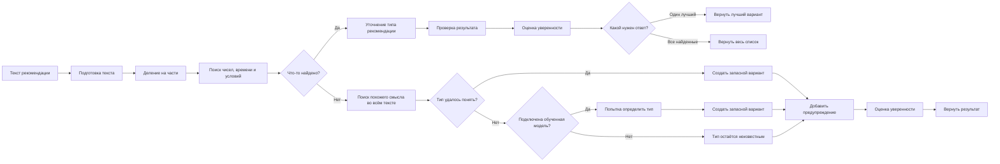

# Схема работы алгоритма интерпретации рекомендаций

Документ описывает фактический пайплайн, реализованный в модуле `app/recommendation_extraction/`.

## Точки входа

- `POST /api/recommendations/interpret`
  Возвращает один лучший разбор для обратной совместимости.
- `POST /api/recommendations/interpret-multi`
  Возвращает все найденные рекомендации в одном тексте.
- `app/recommendation_parser.py`
  Фасад над `parse_recommendation()` и `parse_recommendations()`.

## Общая блок-схема

## Кратко для презентации

Алгоритм работает в такой последовательности:

1. Получает текст рекомендации от врача.
2. Приводит текст к удобному виду: исправляет частые опечатки, время и единицы измерения.
3. Делит длинную фразу на отдельные смысловые части.
4. В каждой части ищет важные данные: тип рекомендации, число, время, условие.
5. Если данные найдены, проверяет, правильно ли понят смысл.
6. Если точного совпадения нет, пытается определить общий смысл по похожим словам.
7. Если и этого недостаточно, использует обученную модель как запасной способ.
8. Проверяет результат, оценивает надёжность и возвращает один лучший вариант или весь список.

## Пошаговая логика

### 1. Нормализация текста

Функция: `normalize_text(text)`

Что делает:

- приводит текст к нижнему регистру и обрезает пробелы;
- заменяет латинские гомоглифы на кириллицу;
- унифицирует `ё -> е`;
- нормализует тире и минус;
- преобразует десятичные запятые: `0,8 -> 0.8`;
- исправляет частые опечатки и сохраняет это в `errors_or_warnings`;
- разъединяет слепленные токены вида `10гр`, `1ед`;
- приводит время к формату `HH:MM`;
- нормализует обозначения единиц измерения.

Результат:

- `normalized_text`
- список предупреждений `warnings`

### 2. Разбиение на смысловые фрагменты

Функция: `_iter_clauses(normalized_text)`

Текст делится на части по:

- `;`
- переводу строки
- части запятых, если дальше начинается новая рекомендация

Это нужно для обработки составных фраз вида:

`базал 0.8 ед/ч..., углеводный коэффициент 1 ед/9 г..., предболюс 15 мин...`

### 3. Извлечение кандидатов по правилам

Функция: `_rule_extract(text, normalized_text)`

Для каждого `clause` строится базовый кандидат через `_base_candidate()`, который сразу пытается извлечь:

- `time_start`
- `time_end`
- `condition`

Далее clause проверяется набором регулярных выражений. Поддерживаемые типы:

- `basal_rate`
- `carb_ratio`
- `correction_factor`
- `target_glucose`
- `target_range`
- `prebolus_time`
- `temp_basal_percent`
- `active_insulin_time`
- `dual_bolus_split`
- `correction_interval`
- `low_glucose_alert_threshold`
- `high_glucose_alert_threshold`

Особенности:

- для `basal_rate` есть строгий и мягкий шаблон;
- для некоторых типов есть несколько синтаксических вариантов;
- часть единиц автоматически конвертируется:
  - `prebolus_time`: часы -> минуты;
  - `active_insulin_time`: минуты -> часы;
  - `correction_interval`: минуты -> часы;
- дубликаты кандидатов отбрасываются через `_append_candidate()`.

Если поиск по правилам сработал, кандидат получает:

- `recommendation_type`
- `value` или `value_min/value_max`
- `unit`
- `parse_method = rule_regex`
- запись в `trace`

### 4. Уточнение типа рекомендации по похожим словам

Функция: `match_recommendation_types(text, threshold=62.0)`

Если кандидаты уже найдены, для каждого кандидата выполняется сопоставление с алиасами из словаря:

- текст и алиасы дополнительно нормализуются;
- балл сходства считается по нескольким признакам;
- если ключевое слово буквально входит в текст, балл повышается;
- очень короткие сокращения принимаются только при точном совпадении.

Если лучший найденный тип совпадает с типом, найденным по правилам:

- `parse_method` меняется на `hybrid`;
- в `trace` добавляется запись с найденным словом и баллом сходства.

### 5. Запасной путь, если точные правила не сработали

Если `_rule_extract()` не вернул кандидатов, строится один запасной вариант на весь текст.

Порядок действий:

1. Поиск наиболее похожего типа рекомендации по словарю.
2. Если это не помогло, использование обученной модели.
3. Если и это не помогло, тип остаётся `unknown`.

Во всех таких случаях добавляется предупреждение:

- `no robust value pattern found`

Важно:

- запасной путь обычно помогает понять тип рекомендации;
- но без точного совпадения по правилам число и интервал могут остаться нераспознанными.

### 6. Проверка результата

Функция: `validate_candidate(candidate)`

Проверяет:

- не совпадают ли начало и конец интервала;
- верно ли задан диапазон;
- попадает ли значение в ожидаемые пределы;
- корректно ли задано соотношение при `dual_bolus_split`.

Проверки не отменяют результат, а добавляют предупреждения в:

- `errors_or_warnings`

### 7. Оценка уверенности

Функция: `_compute_confidence(candidate, fuzzy_score, used_ml)`

На итоговую оценку влияют:

- удалось ли определить тип;
- найдено ли число или диапазон;
- найдена ли единица измерения;
- найдено ли время;
- найдено ли условие;
- есть ли хорошее совпадение по похожим словам.

Уверенность снижается, если:

- пришлось использовать запасную модель;
- накопилось много предупреждений.

Итоговое значение ограничивается диапазоном:

- `0.0 .. 1.0`

### 8. Формирование ответа

Структура одного объекта результата:

- `recommendation_type`
- `text`
- `normalized_text`
- `value`
- `value_min`
- `value_max`
- `unit`
- `time_start`
- `time_end`
- `condition`
- `confidence`
- `parse_method`
- `errors_or_warnings`
- `trace`

Режимы возврата:

- `parse_recommendation()` / `/interpret`
  Возвращает один объект с максимальным `confidence`.
- `parse_recommendations()` / `/interpret-multi`
  Возвращает список всех найденных объектов.

## Ключевая идея алгоритма

Алгоритм в проекте гибридный:

- сначала он пытается точно извлечь данные по понятным правилам;
- затем уточняет смысл по похожим словам;
- в сложных случаях использует обученную модель как запасной путь.

То есть сначала система старается надёжно найти числа, время и условия, а уже потом подключает более гибкие способы распознавания смысла.
