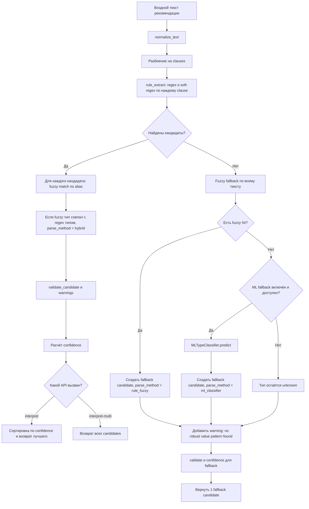

# Схема работы алгоритма интерпретации рекомендаций

Документ описывает фактический пайплайн, реализованный в модуле `app/recommendation_extraction/`.

## Точки входа

- `POST /api/recommendations/interpret`
  Возвращает один лучший разбор для обратной совместимости.
- `POST /api/recommendations/interpret-multi`
  Возвращает все найденные рекомендации в одном тексте.
- `app/recommendation_parser.py`
  Фасад над `parse_recommendation()` и `parse_recommendations()`.

## Общая блок-схема

## Пошаговая логика

### 1. Нормализация текста

Функция: `normalize_text(text)`

Что делает:

- приводит текст к нижнему регистру и обрезает пробелы;
- заменяет латинские гомоглифы на кириллицу;
- унифицирует `ё -> е`;
- нормализует тире и минус;
- преобразует десятичные запятые: `0,8 -> 0.8`;
- исправляет частые опечатки и сохраняет это в `errors_or_warnings`;
- разъединяет слепленные токены вида `10гр`, `1ед`;
- приводит время к формату `HH:MM`;
- нормализует обозначения единиц измерения.

Результат:

- `normalized_text`
- список предупреждений `warnings`

### 2. Разбиение на смысловые фрагменты

Функция: `_iter_clauses(normalized_text)`

Текст делится на части по:

- `;`
- переводу строки
- части запятых, если дальше начинается новая рекомендация

Это нужно для обработки составных фраз вида:

`базал 0.8 ед/ч..., углеводный коэффициент 1 ед/9 г..., предболюс 15 мин...`

### 3. Rule-based извлечение кандидатов

Функция: `_rule_extract(text, normalized_text)`

Для каждого `clause` строится базовый кандидат через `_base_candidate()`, который сразу пытается извлечь:

- `time_start`
- `time_end`
- `condition`

Далее clause проверяется набором регулярных выражений. Поддерживаемые типы:

- `basal_rate`
- `carb_ratio`
- `correction_factor`
- `target_glucose`
- `target_range`
- `prebolus_time`
- `temp_basal_percent`
- `active_insulin_time`
- `dual_bolus_split`
- `correction_interval`
- `low_glucose_alert_threshold`
- `high_glucose_alert_threshold`

Особенности:

- для `basal_rate` есть строгий и мягкий шаблон;
- для некоторых типов есть несколько синтаксических вариантов;
- часть единиц автоматически конвертируется:
  - `prebolus_time`: часы -> минуты;
  - `active_insulin_time`: минуты -> часы;
  - `correction_interval`: минуты -> часы;
- дубликаты кандидатов отбрасываются через `_append_candidate()`.

Если regex сработал, кандидат получает:

- `recommendation_type`
- `value` или `value_min/value_max`
- `unit`
- `parse_method = rule_regex`
- запись в `trace`

### 4. Fuzzy-подтверждение rule-based результата

Функция: `match_recommendation_types(text, threshold=62.0)`

Если rule-based кандидаты найдены, для каждого кандидата выполняется fuzzy-сопоставление с алиасами из словаря:

- текст и алиасы дополнительно нормализуются;
- score считается как комбинация:
  - `partial_ratio`
  - `token_set_ratio`
  - Jaccard по символьным триграммам
- если алиас буквально входит в текст, score повышается;
- короткие алиасы длиной до 3 символов принимаются только при точном попадании токена.

Если лучший fuzzy hit совпадает по типу с уже найденным regex-типом:

- `parse_method` меняется на `hybrid`;
- в `trace` добавляется запись с alias и score.

### 5. Fallback, если regex ничего не нашёл

Если `_rule_extract()` не вернул кандидатов, строится один fallback-кандидат на весь текст.

Порядок fallback:

1. `rule_fuzzy`
   Если fuzzy match нашёл тип выше порога, заполняется только `recommendation_type`.
2. `ml_classifier`
   Если fuzzy не сработал, а `enable_ml_fallback=True` и модель доступна, используется `MLTypeClassifier.predict()`.
3. `unknown`
   Если и fuzzy, и ML не помогли, тип остаётся `unknown`.

Во всех fallback-сценариях добавляется warning:

- `no robust value pattern found`

Важно:

- fallback обычно определяет тип рекомендации,
- но не извлекает надёжно числовое значение, если regex-шаблон не сработал.

### 6. Валидация кандидата

Функция: `validate_candidate(candidate)`

Проверяет:

- одинаковое начало и конец временного интервала;
- корректность диапазона `value_min < value_max`;
- попадание значений в ожидаемые медицинские диапазоны по каждому типу;
- для `dual_bolus_split` проверяет, что доли суммарно близки к `100%`.

Проверки не блокируют результат, а добавляют предупреждения в:

- `errors_or_warnings`

### 7. Расчёт confidence

Функция: `_compute_confidence(candidate, fuzzy_score, used_ml)`

Итоговая уверенность собирается из признаков:

- распознан тип;
- найдено значение или диапазон;
- найдена единица измерения;
- найден временной интервал;
- найдено условие;
- есть положительный fuzzy score.

Штрафы:

- за использование ML fallback;
- за накопленные warnings.

Итоговое значение ограничивается диапазоном:

- `0.0 .. 1.0`

### 8. Формирование ответа

Структура одного объекта результата:

- `recommendation_type`
- `text`
- `normalized_text`
- `value`
- `value_min`
- `value_max`
- `unit`
- `time_start`
- `time_end`
- `condition`
- `confidence`
- `parse_method`
- `errors_or_warnings`
- `trace`

Режимы возврата:

- `parse_recommendation()` / `/interpret`
  Возвращает один объект с максимальным `confidence`.
- `parse_recommendations()` / `/interpret-multi`
  Возвращает список всех найденных объектов.

## Ключевая идея алгоритма

Алгоритм в проекте гибридный:

- основа распознавания: rule-based regex извлечение значений;
- усиление классификации: fuzzy match по словарю алиасов;
- резервный механизм: ML-классификатор только когда rule-based слой не дал кандидатов.

То есть точные численные параметры извлекаются в первую очередь правилами, а fuzzy/ML используются в основном для определения типа рекомендации и повышения устойчивости к шумному тексту.
